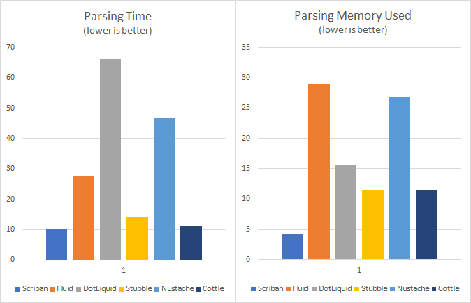

# Benchmarks

Latest benchmark update: 23 October 2017

This is a simple, non-exhaustive benchmark that should highlight how fast and lightweight Scriban parser and runtime is.

> NOTE: This is a micro benchmark, so results may vary vastly on use cases. The goal here is to demonstrate on a very simple example how the different engines behave
> Also, Scriban has not been optimized for this particular scenario tested here and little has been done so far to optimize the runtime, so even if Scriban is already blazing fast, there is no doubt that it can still be improved!

While Scriban is compared here to `liquid` and `mustache` like templating engines, you should also keep in mind that language-wise, Scriban is allowing more language constructions/expressions.

The benchmark was performed on two aspects of the libraries:

- The [**Parser Benchmark**](#parser-benchmarks): How long does it take to parse a template to a runtime representation? How much memory is used?
- The [**Rendering Benchmark**](#rendering-benchmarks): How long does it take to render a template with some input datas? How much memory is used?

Libraries used in this comparison:

- Scriban (0.9.0)
- [DotLiquid](https://github.com/dotliquid/dotliquid) (2.0.200)
- [Nustache](https://github.com/jdiamond/Nustache) (1.16.0.4) - Mustache based
- [Stubble](https://github.com/StubbleOrg/Stubble) (1.0.42-alpha17) - Mustache+ based
- [Handlebars.NET](https://github.com/rexm/Handlebars.Net) (1.9.0)

For benchmarking, we are using the fantastic [BenchmarkDotNet](https://github.com/dotnet/BenchmarkDotNet)

See the [Scriban.Benchmark/Program.cs](../src/Scriban.Benchmarks/Program.cs) for details of the benchmark implementation.

[:top:](#benchmarks)
## Overall results

- **Scriban is 1.5x to x10 times faster** than other templating engines
- **Scriban is 3x to 30x more memory efficient** both at parsing and runtime time, than other templating engines (except with Handlebars.NET at rendering time which is on par)

In the following sections, you will find benchmark details.

[:top:](#benchmarks)
## Parser Benchmarks

The methodology is to compile the following Scriban script:

```html
<ul id='products'>
  {{ for product in products }}
    <li>
      <h2>{{ product.name }}</h2>
           Only {{ product.price }}
           {{ product.description | string.truncate 15 }}
    </li>
  {{ end }}
</ul>
```

Or the equivalent Liquid script

```html
<ul id='products'>
  
    <li>
      <h2>{{ product.name }}</h2>
           Only {{ product.price }}
           {{ product.description | truncate: 15 }}
    </li>
  
</ul>
```

Or the pseudo-equivalent Mustache script:

```html
<ul id='products'>
  {{#products}}
    <li>
      <h2>{{ name }}</h2>
           Only {{ price }}
           {{#truncate}}{{description}}{{/truncate}}
    </li>
  {{/products}}
</ul>
```

The raw results of the benchmarks are:

```
// * Summary *

BenchmarkDotNet=v0.10.9, OS=Windows 10.0.16299
Processor=Intel Core i7-7700K CPU 4.20GHz (Kaby Lake), ProcessorCount=8
  [Host]     : .NET Framework 4.7 (CLR 4.0.30319.42000), 32bit LegacyJIT-v4.7.2556.0
  DefaultJob : .NET Framework 4.7 (CLR 4.0.30319.42000), 32bit LegacyJIT-v4.7.2556.0


                    Method |        Mean |     Error |    StdDev |   Gen 0 |  Gen 1 | Allocated |
-------------------------- |------------:|----------:|----------:|--------:|-------:|----------:|
        'Scriban - Parser' |    10.59 us | 0.0624 us | 0.0521 us |  0.6104 |      - |   2.54 KB |
      'DotLiquid - Parser' |    71.45 us | 1.1307 us | 1.0024 us |  2.1973 |      - |   9.47 KB |
        'Stubble - Parser' |    12.29 us | 0.0982 us | 0.0918 us |  1.6327 |      - |   6.74 KB |
       'Nustache - Parser' |    53.98 us | 0.1557 us | 0.1300 us |  4.0894 |      - |  16.84 KB |
 'Handlebars.NET - Parser' | 1,005.38 us | 6.5709 us | 5.8250 us | 25.3906 | 1.9531 | 106.81 KB |

// * Legends *
  Mean      : Arithmetic mean of all measurements
  Error     : Half of 99.9% confidence interval
  StdDev    : Standard deviation of all measurements
  Gen 0     : GC Generation 0 collects per 1k Operations
  Gen 1     : GC Generation 1 collects per 1k Operations
  Allocated : Allocated memory per single operation (managed only, inclusive, 1KB = 1024B)
  1 us      : 1 Microsecond (0.000001 sec)
```

About the results, we couldn't include Handlebars.NET in the following chart, as it is compiling to IL so it takes a lot more time to compile a template.



[:top:](#benchmarks)
## Rendering Benchmarks

The methodology is to use the previously compiled script and use it with a list of 500 Products to output a final string

```
     Method |      Mean |     Error |    StdDev |     Gen 0 |   Gen 1 |   Gen 2 |   Allocated |
----------- |----------:|----------:|----------:|----------:|--------:|--------:|------------:|
    Scriban |  1.976 ms | 0.0069 ms | 0.0062 ms |  148.4375 | 27.3438 | 27.3438 |   647.41 KB |
  DotLiquid |  7.810 ms | 0.0460 ms | 0.0408 ms |  687.5000 | 31.2500 | 23.4375 |  2923.73 KB |
    Stubble |  3.507 ms | 0.0274 ms | 0.0256 ms |  593.7500 | 39.0625 | 27.3438 |  2522.75 KB |
   Nustache | 21.598 ms | 0.2369 ms | 0.1978 ms | 3718.7500 |       - |       - | 15444.73 KB |
 Handlebars |  3.404 ms | 0.0236 ms | 0.0209 ms |  171.8750 | 31.2500 | 27.3438 |   766.34 KB |
 ```

Note that for Stubble, It was not possible to match the behavior of the other engines, so it is including the parsing time (which is anyway insignificant compare to the rendering time in this particular case)


